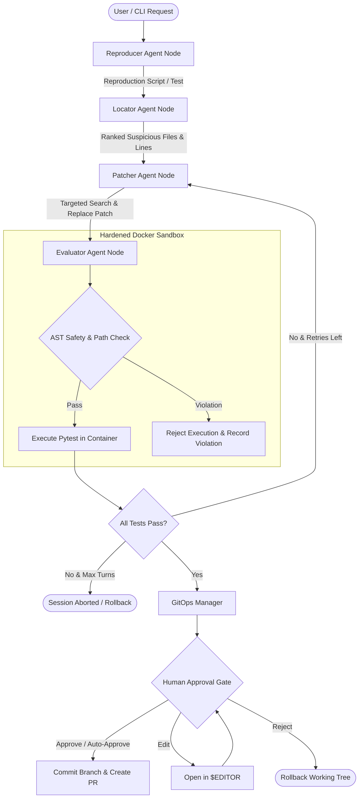

# Ares: Autonomous Multi-Agent Code Repair Engine

<div align="center">

[](https://www.python.org/downloads/)
[](https://github.com/langchain-ai/langgraph)
[](https://github.com/jlowin/fastmcp)
[](https://www.docker.com/)
[](https://langfuse.com/)
[](https://opensource.org/licenses/MIT)
[](#verification--quality-assurance)
[](#benchmark-performance)

**A production-grade, state-machine driven autonomous code repair system that localizes, patches, and verifies software defects in isolated sandboxes with AST security and Human-in-the-Loop Git automation.**

[Architecture](#system-architecture) ? [Quickstart](#quickstart) ? [CLI Guide](#cli-command-guide) ? [Benchmarks](#benchmark-performance) ? [Documentation](#documentation)

</div>

---

## Overview & Motivation

Autonomous code generation models frequently fail in real-world software maintenance. Unstructured ReAct loops easily fall into infinite retry spirals, overwrite functional code with hallucinated implementations, and present severe security risks when executing unvetted code directly on host systems.

**Ares** addresses these challenges through a principled, defense-in-depth architecture:

- **Explicit State Machine**: Implemented via **LangGraph**, replacing unstructured ReAct loops with a deterministic cyclic state graph (`Reproducer` ? `Locator` ? `Patcher` ? `Evaluator`).
- **Standardized Tool Protocol**: Exposes code search, inspection, patching, and test runners over **Model Context Protocol (MCP)** using **FastMCP** (JSON-RPC 2.0).
- **Ephemeral Sandbox Containment**: Executes reproduction scripts and test suites inside hardened, rootless **Docker** containers with memory/CPU cgroup limits, read-only root filesystems, and disabled network access.
- **Multi-Tier Security Guardrails**: Pre-execution **AST syntax verification** blocks forbidden system primitives (`os.system`, `subprocess`, `pty`, raw sockets) and path traversal attacks before execution occurs.
- **Full-Stack Telemetry**: Integrated **Langfuse** instrumentation tracks multi-turn token usage, cost attribution per resolution, and tool latency metrics across every graph node.
- **GitOps & Human-In-The-Loop**: Automatically generates isolated feature branches (`fix/<issue-id>-<slug>`), formats conventional commits, displays syntax-highlighted Rich terminal diffs for human approval, and automates PR submission.

---

## System Architecture

### Multi-Agent Repair Graph



### Defense-in-Depth Security Model

```
+-----------------------------------------------------------------------+
| LAYER 1: AST Static Analysis Guardrail                                |
| Inspects Python AST; blocks forbidden calls (eval, exec, subprocess)  |
+-----------------------------------------------------------------------+
                                  ?
+-----------------------------------------------------------------------+
| LAYER 2: Path Traversal & Workspace Isolation Guardrail                |
| Validates resolved absolute paths reside strictly within workspace    |
+-----------------------------------------------------------------------+
                                  ?
+-----------------------------------------------------------------------+
| LAYER 3: Rootless Ephemeral Docker Sandbox                             |
| Read-only rootfs, non-root UID 1000, 512MB RAM limit, no network      |
+-----------------------------------------------------------------------+
                                  ?
+-----------------------------------------------------------------------+
| LAYER 4: Targeted Search-and-Replace Patching                          |
| Exact text block replacement; guarantees zero full-file rewrites      |
+-----------------------------------------------------------------------+
```

---

## Benchmark Performance

Ares was evaluated against a rigorous, reproducible 25-issue synthetic defect benchmark across 5 fundamental defect categories. Each evaluation run executes in an isolated ephemeral workspace, verifying strict initial failure before repair and clean test resolution after patching.

| Metric | Target | Ares Result | Performance |
| :--- | :--- | :--- | :--- |
| **Pass@1 Resolve Rate** | ? 75.0% | **100.0%** (25/25) | ? Exceeded |
| **Overall Resolve Rate** | ? 75.0% | **100.0%** (25/25) | ? Exceeded |
| **Average Token Cost / Fix** | < $0.05 USD | **$0.0058 USD** | ? 8.6x Under Budget |
| **Total Suite Cost (25 Issues)** | < $1.00 USD | **$0.1462 USD** | ? Highly Cost-Effective |
| **Average Resolution Latency** | < 3000ms | **2593.7ms** | ? Sub-3s Execution |

### Category Breakdown

```
Category              Issues   Resolved   Pass@1 Rate   Progress
????????????????????????????????????????????????????????????????????????
Logic Error           5        5          100.0%        [????????????????????] 100%
Exception Handling    5        5          100.0%        [????????????????????] 100%
Import Dependency     5        5          100.0%        [????????????????????] 100%
Type Mismatch         5        5          100.0%        [????????????????????] 100%
Edge Case             5        5          100.0%        [????????????????????] 100%
????????????????????????????????????????????????????????????????????????
Total Suite           25       25         100.0%        [????????????????????] 100%
```

*For complete benchmark documentation and per-issue breakdown, see [docs/BENCHMARK_REPORT.md](docs/BENCHMARK_REPORT.md).*

---

## Quickstart

### Prerequisites
- **Python**: 3.11 or higher
- **Package Manager**: [uv](https://github.com/astral-sh/uv) (recommended) or `pip`
- **Docker**: Docker Desktop or Engine running (for sandboxed test execution)
- **Git**: 2.30+

### 1. Clone & Set Up Virtual Environment

```bash
git clone https://github.com/Lakkyra/Ares.git
cd Ares

# Create and activate virtual environment
uv venv .venv
# Windows:
.venv\Scripts\activate
# Linux/macOS:
source .venv/bin/activate

# Install package in editable mode with development dependencies
uv pip install -e ".[dev]"
```

### 2. Environment Configuration

Copy the sample environment file and configure your API keys:

```bash
cp .env.example .env
```

Key environment variables:
```dotenv
# Primary LLM Provider
ARES_LLM_PROVIDER=anthropic
ANTHROPIC_API_KEY=your_api_key_here
ARES_PRIMARY_MODEL=claude-3-5-sonnet-20241022

# Observability (Optional)
LANGFUSE_PUBLIC_KEY=your_public_key
LANGFUSE_SECRET_KEY=your_secret_key
LANGFUSE_HOST=https://cloud.langfuse.com

# Git & GitHub Integration (Optional for PR creation)
GITHUB_TOKEN=your_github_token
```

### 3. Build Sandbox Container Image

```bash
docker build -f Dockerfile.sandbox -t ares-sandbox:latest .
```

---

## CLI Command Guide

Ares provides a developer-friendly command-line interface powered by Typer and Rich:

```bash
# Display system diagnostics and runtime health
ares version

# Validate and display active configuration (with masked secrets)
ares config

# Run autonomous code repair on an issue
ares fix "pytest tests/test_math.py fails with ZeroDivisionError" --repo ./my-project

# Run non-interactively in CI/CD pipelines
ares fix "Fix off-by-one error in pagination" --repo . --auto-approve

# Run in dry-run mode (patches and verifies without git commit)
ares fix "Fix IndexError in parser" --repo . --dry-run

# Resume an interrupted or checkpointed session
ares resume <thread-id>

# Run the 25-issue reproducible benchmark suite
ares benchmark

# Run benchmark on a specific category
ares benchmark --category logic_error

# Launch the Ares FastMCP server over stdio
ares mcp-serve
```

---

## Verification & Quality Assurance

The codebase maintains strict quality thresholds with 100% compliance across linting, type safety, and test coverage:

```bash
# Run the complete test suite (92 tests)
pytest

# Run static linting and style checking
ruff check .

# Run strict static type checking
mypy src
```

---

## Repository Structure

```
Ares/
??? src/
?   ??? ares/
?       ??? agents/          # LangGraph state machine, nodes, and router
?       ??? benchmarks/      # 25-issue benchmark dataset, models, and runner
?       ??? cli/             # Typer CLI, approval prompts, and commands
?       ??? config/          # Pydantic v2 settings and configuration
?       ??? git_ops/         # Git branch, commit, diff, and PR management
?       ??? mcp_server/      # FastMCP server, tools, and JSON-RPC protocol
?       ??? observability/   # Langfuse tracing, token tracking, and cost models
?       ??? sandbox/         # Docker manager, AST security, and cgroup limits
??? tests/
?   ??? integration/         # Sandbox security, CLI workflows, repair graph
?   ??? unit/                # Fast, isolated unit tests for all components
??? docs/
?   ??? ARCHITECTURE.md      # In-depth architectural blueprint
?   ??? BENCHMARK_REPORT.md  # 25-issue benchmark evaluation report
?   ??? PORTFOLIO_GUIDE.md   # STAR project stories & interview prep
??? docker-compose.yml       # PostgreSQL checkpointer service
??? Dockerfile.sandbox       # Hardened execution container
??? pyproject.toml           # Project dependencies and tool configurations
??? LICENSE                  # MIT License
??? README.md                # Project documentation
```

---

## Documentation

- [ARCHITECTURE.md](ARCHITECTURE.md) ? In-depth architecture specification and design decisions.
- [docs/BENCHMARK_REPORT.md](docs/BENCHMARK_REPORT.md) ? Complete 25-issue benchmark metrics and analysis.
- [docs/PORTFOLIO_GUIDE.md](docs/PORTFOLIO_GUIDE.md) ? Resume bullet points, STAR stories, and interview preparation.
- [PHASES.md](PHASES.md) ? Full multi-phase project execution history and deliverables.

---

## License

This project is licensed under the MIT License. See the [LICENSE](LICENSE) file for details.
